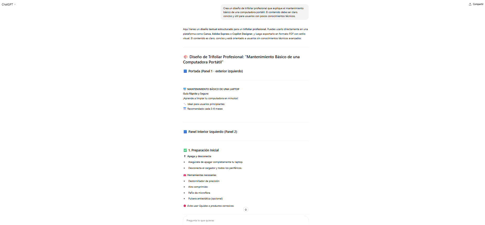
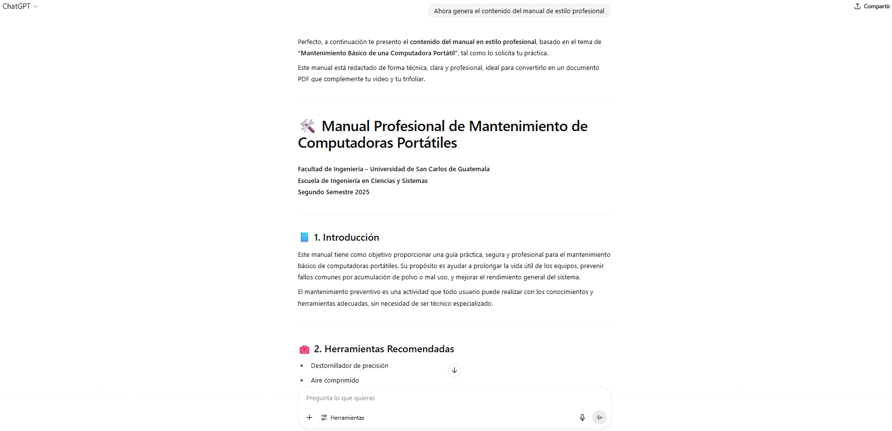
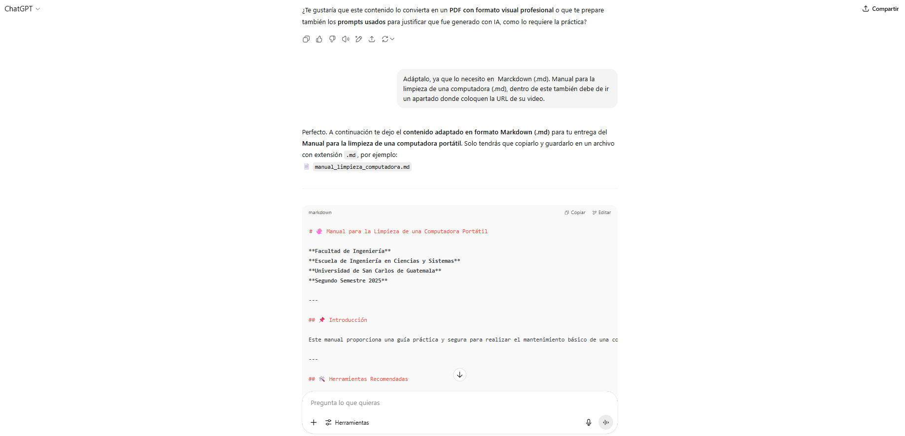

# 🤖 Documento de Prompts Utilizados para Generación de Contenido con IA

**Facultad de Ingeniería**  
**Escuela de Ingeniería en Ciencias y Sistemas**  
**Universidad de San Carlos de Guatemala**  
**Segundo Semestre 2025**  

---

## 📝 Introducción

Este documento recopila los prompts utilizados en herramientas de inteligencia artificial para generar el contenido del **manual profesional** y del **trifoliar** requerido en el Informe 1.  
La generación del contenido se realizó cumpliendo con los criterios de claridad, precisión técnica y estilo profesional, orientado a estudiantes con conocimientos básicos en mantenimiento de computadoras portátiles.

---

## 📘 Prompt para el Trifoliar y Manual Profesional

> **Prompt utilizado:**  

---

### 📷 Evidencia de generación (imágenes)

  

  

